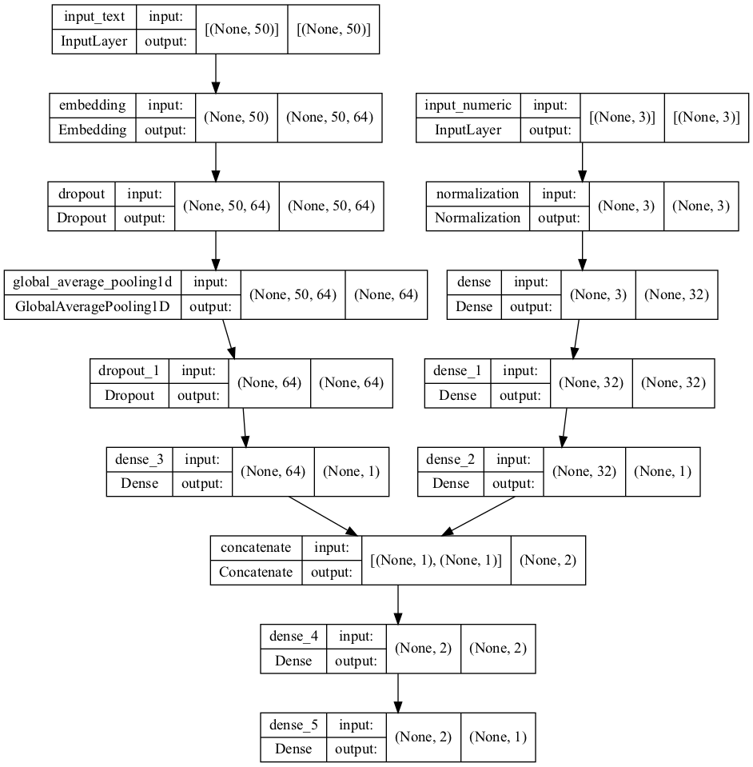
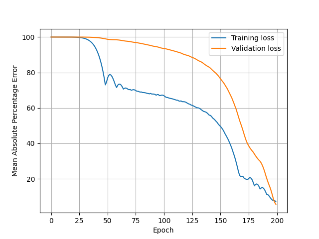

# 1. Word count in PySpark

## Requirements

- Docker
- Docker images:
  - Spark
- Python 3.6
- Python libraries:
  - PySpark

## Installation

### Docker and Spark

1. Follow the instructions of [Docker](https://docs.docker.com/get-docker/) to install Docker on your machine.

2. Pull the Apache Spark Docker image (this takes some time to download):
   ```bash
   docker run -v ~/spark/work:/home/jovyan/work -d -p 8888:8888 jupyter/pyspark-notebook
   ```

3. Check if the container with the `jupyter/pyspark-notebook` image is running:
   ```bash
   docker ps
   ```

### PySpark (Miniconda)

We recommend users to use [Conda](https://docs.conda.io/en/latest/) to configure the Python environment.

1. Follow the instructions of [Miniconda Installation](https://conda.io/projects/conda/en/latest/user-guide/install/index.html) to install Miniconda.
2. Clone this repository and cd to it.
   ```bash
   git clone https://github.com/fabianbauermarquart/movie-ml.git && cd movie-ml
   ```
3. Use Conda to create and activate a new Conda environment:
   ```bash
   conda create --name spark python=3.6
   conda activate spark
   ```
4. Install the libraries:
   ```bash
   pip install -r requirements.txt
   ```
   
### Download data 

```bash
wget https://s3.amazonaws.com/products-42matters/test/biographies.list.gz --directory-prefix=./resources
gunzip ./resources/biographies.list.gz
```


### Running the code

```bash
spark-submit word_counts.py -i ./resources/biographies2.list -o ./out/biographies_word_count
```


The results are found in the directory `./out/biographies_word_count`.


# 2. Movie view estimations

Follow the same installation instructions as above. 


### Running the code

```bash
python movie_view_estimations.py
```

### Approach

This task is about mixed data: numeric and text.

The available data are (250 data points):
- Movie title
- Year released
- Review score
- Number of reviews

The data to be inferred is:
- Number of views (very limited amount of data, only 6 data points)

Unfortunately, this means we have to perform an inner join of the two datasets because when performing supervised learning,
missing data is of no help and can even lead to overfitting when trying to interpolate.
Because we need to handle mixed data, we need to combine two models, one standard fully-connected deep neural network (for numeric data)
and one that processes word embeddings with several dropout and one pooling layer (for text data),
to perform regression.

The model architecture is shown below:



As loss function, mean absolute percentage error is chosen.
Training is performed over 200 training epochs.



The final error value after training is:

- Training: 10.42%
- Validation: 9.08%
- Test: 47.57%

While there doesn't occur any overfitting during training, as seen via the validation data,
the model's error on the test set is 47.57%, which is not as good as hoped for,
but expected to improve when more data points are added to view data set.

This approach's pros and cons are listed below:

| Pros                                                            | Cons                         |
|-----------------------------------------------------------------|------------------------------|
| We can regress mixed data, i.e. text and numbers with one model | Test data error is about 48% |
| The model trains quickly in under a minute                      |                              |
| It performs with only about 9% error on the validation set      |                              |


An alternative here would be to use an LSTM layer for handling the text data.
The pros and cons of an LSTM layer are the following:


| Pros                                                 | Cons                                               |
|------------------------------------------------------|----------------------------------------------------|
| Standard for text classification in machine learning | No performance improvement when text is very short |
| Keeps track of words that came earlier in the text   |                                                    |
